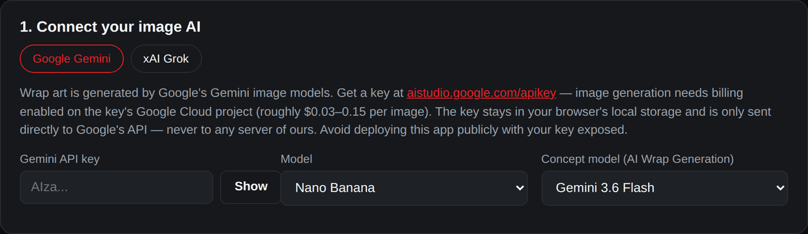
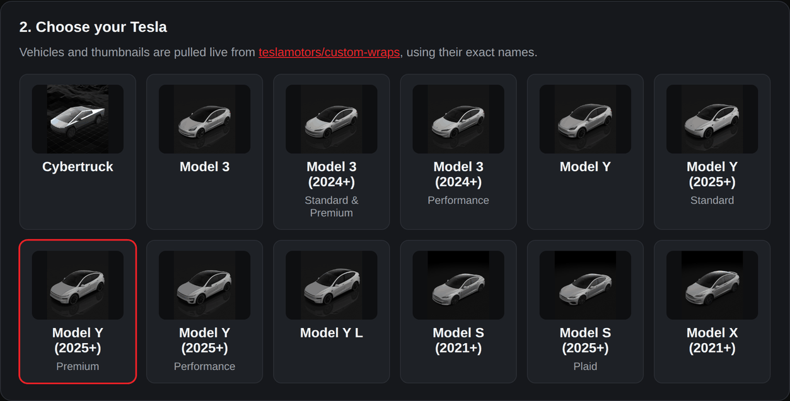
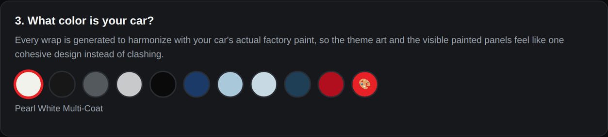
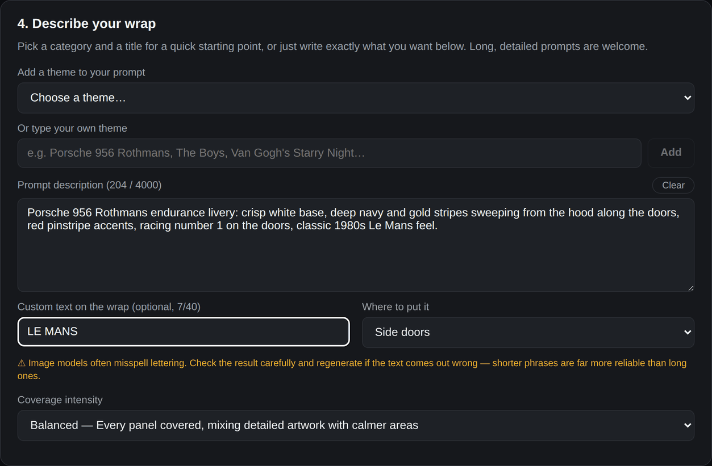

# Wrap Studio for Tesla

A web app for designing AI-generated custom wraps for your Tesla, built directly on
top of the official templates and vehicle list from
[teslamotors/custom-wraps](https://github.com/teslamotors/custom-wraps).

> **Unofficial project.** Not affiliated with, endorsed by, or sponsored by Tesla, Inc.
> See [Disclaimer](#disclaimer).

## What it does

1. **Pick your exact Tesla** from the same 12 vehicles/trims listed in the
   teslamotors/custom-wraps README (Cybertruck, Model 3, Model 3 (2024+) Standard &
   Premium / Performance, Model Y, Model Y (2025+) Standard / Premium / Performance,
   Model Y L, Model S (2021+), Model S (2025+) Plaid, Model X (2021+)) — names and
   thumbnails are fetched live from that repo, so they always match.
2. **Tell it your factory paint color**, including Glacier Blue, Frost Blue, Marine
   Blue, Deep Blue Metallic, Pearl White Multi-Coat, Solid Black, Diamond Black,
   Stealth Grey, Quicksilver, Ultra Red, or a custom color — every generated wrap is
   prompted to harmonize with it instead of clashing.
3. **Describe the wrap you want** in a long-form prompt box (up to 4000 characters).
   A theme picker jump-starts ideas. It leads with Supercars & Sports Cars (iconic
   Ferrari, Lamborghini, Porsche, McLaren, Bugatti liveries and more), then Motorsport,
   Gaming, Movies, TV Shows, Anime & Comics, JDM & Street, Space & Sci-Fi, Luxury &
   Stealth, Nature & Abstract, and Retro & Graphic. You can also type your own theme.
   Optional custom lettering can go on the doors, hood or rear. A coverage intensity
   control sets how busy the design is (subtle / balanced / bold).
4. **Generate Wrap** uses your description as-is. **✨ AI Wrap Generation** invents a
   full creative concept for you (optionally steered by whatever you've already typed)
   and generates it immediately — for when you just want something great without
   writing the brief yourself.
5. **Preview window** shows Tesla's official blank template next to your generated
   result, and lets you download it as a spec-compliant PNG.
6. **Use it on every other Tesla.** Once you like a wrap, redraw it onto another
   vehicle's template, or press **Redraw for all models** to do the remaining 11 in
   one go. They run one at a time. **Download all (.zip)** bundles every finished
   wrap with one folder per vehicle. A quota or API-key error stops the batch
   instead of failing each remaining model in turn, and pressing the button again
   later picks up where it left off.

## Screenshots

**Connect your image AI**: choose Gemini or Grok, paste your API key, and pick the image
model plus the concept model used by AI Wrap Generation:



**Pick your exact Tesla**, straight from Tesla's official template list:



**Match your factory paint**, so the wrap works with the panels it doesn't cover:



**Describe the wrap**, or start from a theme, add optional lettering, and set how busy
it should be:



## Loading the wrap into your Tesla

**Download PNG** gives you a file that already meets Tesla's requirements: PNG,
512–1024 px, no larger than 1 MB, and a filename of 30 characters or fewer using only
letters, numbers, underscores and spaces. You don't need to edit or resize it. If you used
**Download all (.zip)**, unzip it first and take the PNG from your vehicle's folder.
Each wrap only fits the model it was drawn for.

### Option A: Tesla app (no USB needed)

Requires Tesla app **v4.59.0 or later**.

1. Get the PNG onto your phone. Either open this app in the phone's browser and download
   it there, or send the file from your computer (AirDrop, email, cloud drive, messaging
   app) and save it to **Photos** or **Files**.
2. In the Tesla app, go to **Creations → Wrap → Upload** and pick the PNG.
3. In the car, open **Toybox → Paint Shop → Wraps** and select it.

### Option B: USB drive

1. Format a USB drive as **exFAT**, **FAT32** (MS-DOS FAT on Mac), **ext3** or
   **ext4**. NTFS is not supported.
2. Create a folder named exactly `Wraps` at the root of the drive, and copy your PNG
   files into it.
3. Make sure the drive has no map or firmware update files on it, which can stop wraps
   from loading.
4. Plug it into the car's USB port, then open **Toybox → Paint Shop → Wraps** and
   select your wrap.

You can load up to **10 wraps from the app and 10 from USB**. If a wrap doesn't appear,
check the drive format and the `Wraps` folder name first. Tesla's full instructions
are in the [teslamotors/custom-wraps](https://github.com/teslamotors/custom-wraps#requirements--setup)
repository.

## How generation actually works

Rather than generating a wrap from scratch, the app downloads the **real
`template.png`** for your selected vehicle straight from teslamotors/custom-wraps and
sends it to Gemini as an input image alongside your text prompt, asking it to fill in
the existing panel outlines — the same way you'd edit the template by hand. See
[`src/lib/promptBuilder.ts`](src/lib/promptBuilder.ts) and
[`src/lib/gemini.ts`](src/lib/gemini.ts).

This makes two of the trickier requirements structural instead of just prompted:

- **The roof can never get an image or background.** Tesla's own templates don't
  include a roof region at all — their in-car visualizer always renders the glass roof
  on top of whatever wrap is applied, regardless of the template contents. Since
  generation is bounded to the real template's outlines, there's no roof-shaped area
  for anything to be drawn into in the first place.
- **The frunk/hood panel is always instructed to face front.** The template's
  hood/frunk region (the shield-shaped panel with two headlight cutouts) gets an
  explicit directive to compose artwork pointing toward the front of the car — this
  part is still prompt-based, since it lives inside a single generated image rather
  than being a separate structural panel.

## Image providers: Gemini or Grok

Section 1 lets you pick one of two image providers. Everything goes through the provider you pick: the wrap
itself, "AI Wrap Generation" concepts, the on-car preview, and redraws for other models.

> **Both providers need a paid API account.** Neither Gemini's nor Grok's image models
> are available on a free tier. Without billing enabled, every generation fails with a
> quota error. Budget for it: **Redraw for all models** makes 11 image calls in one go.

- **Google Gemini** (default): the `gemini-*-image` family ("Nano Banana") plus a Gemini
  text model for concepts. Creating a key at
  [aistudio.google.com/apikey](https://aistudio.google.com/apikey) is free, but image
  generation only works once **billing is enabled** on the key's Google Cloud project
  (otherwise you get a `429` with `limit: 0`). It costs roughly $0.03–0.15 per image
  depending on model and resolution. See
  [Gemini API pricing](https://ai.google.dev/gemini-api/docs/pricing). Calls go straight
  from your browser to Google.
- **xAI Grok**: `grok-imagine-image-2.0` via xAI's `/v1/images/edits` endpoint, which
  takes the template as an input image, plus `grok-4.7` for concepts. It's prepaid: get
  a key and add credits at [console.x.ai](https://console.x.ai) before the first
  request. It costs roughly $0.04–0.06 per image plus $0.01 per input image. The
  requested aspect ratio matches each template, so Cybertruck's 4:3 layout isn't
  squashed into a square.

xAI's API can't be called straight from a browser, so Grok requests go through this app's
own server (`/api/xai/...` in [`server/index.js`](server/index.js)). The server forwards
your key to `api.x.ai` with each request and never stores or logs it. It only relays the
image-edit, image-generation and chat endpoints. This means **Grok needs the Docker or
`npm run server` version of the app**, not a static-only build.

## Running it locally

```bash
npm install
npm run dev
```

Then open the printed local URL. You'll need a paid API key: a Gemini key from
[aistudio.google.com/apikey](https://aistudio.google.com/apikey) with billing enabled,
or an xAI key with credits for Grok (see
[Image providers](#image-providers-gemini-or-grok)). Paste it into the "Connect your image AI" box. Keys are stored only in your
browser's `localStorage`. Gemini keys go straight to Google. Grok keys pass through
this app's server on their way to xAI (see above), so for Grok also run
`npm run server` alongside `npm run dev`.

**Heads up:** because API calls go straight from the browser, your key is visible in
that browser's network requests. That's fine for local/personal use, but don't deploy
a build of this app publicly with a key embedded or shared.

## Build

```bash
npm run build
```

Type-checks with `tsc` and produces a static `dist/` bundle via Vite — deployable to
any static host, as long as you keep the API-key caveat above in mind.

## Running with Docker

If you'd rather not install Node at all, all you need is Docker with Compose:

```bash
git clone https://github.com/alicenir/tesla-wrap-studio
cd tesla-wrap-studio
docker compose up -d --build
```

Then open `http://localhost:8095`.

The host port is configurable without editing `docker-compose.yml` — copy
`.env.example` to `.env` and set `WRAP_PORT`, or pass it inline:

```bash
WRAP_PORT=9137 docker compose up -d --build
```

### Compose file without cloning

Prefer to skip the clone? Save this as `docker-compose.yml` anywhere, or paste it
into Portainer's **Web editor**. Docker fetches the source from GitHub and builds it
for you:

```yaml
services:
  tesla-wrap-studio:
    build: https://github.com/alicenir/tesla-wrap-studio.git#main
    image: tesla-wrap-studio:latest
    # Rebuild from the latest source on every deploy instead of reusing an old image.
    pull_policy: build
    container_name: tesla-wrap-studio
    ports:
      - "${WRAP_PORT:-8095}:3000"   # change 8095 to any free host port
    restart: unless-stopped
```

```bash
docker compose up -d --build
```

Then open `http://localhost:8095`, or use the host's IP from another machine. To pick up
newer versions later, run the same command again.

### How the image is built

Two-stage build: `node:22-alpine` compiles the bundle, then the runtime image installs
production dependencies only (no Vite, no TypeScript) and runs a small Express server
to serve the built app. Both stages are multi-arch, so this works on x86 and ARM alike
— home servers, Raspberry Pi, Apple Silicon.

No build-time configuration or secrets are needed. API keys are entered in the browser
at runtime and stored in that browser's `localStorage`. A Gemini key never touches the
server. A Grok key is relayed through it to xAI with each request but never stored.
The container needs outbound internet access to `api.x.ai` for Grok.

### Deploying with Portainer

1. In Portainer, go to **Stacks → Add stack**, name it `tesla-wrap-studio`, and choose
   **Repository** as the build method.
2. **Repository URL**: `https://github.com/alicenir/tesla-wrap-studio`
3. **Repository reference**: `refs/heads/main`. Portainer wants the full ref, not just
   the branch name.
4. **Compose path**: `docker-compose.yml`
5. Leave **Authentication** off, since the repository is public. If you deploy from a
   private fork, switch it on and use your GitHub username with a
   [fine-grained token](https://github.com/settings/personal-access-tokens) (Contents:
   read-only) as the password. A normal account password will not work.
6. Optionally set `WRAP_PORT` in the **Environment variables** box to any free port
   (defaults to `8095`) — no file editing needed.
7. Click **Deploy the stack**. The first deploy compiles the bundle, so expect a few
   minutes on slower hardware; later deploys reuse cached layers.

The app is then reachable at `http://<host-ip>:<WRAP_PORT>`. Note that's the Docker host's own
IP — not the container IP Portainer shows in its container list, which is on Docker's
internal network and unreachable from the rest of your LAN.

If the deploy fails with a port-allocation error, that port is already in use — pick
another and redeploy. To see what's taken, SSH into the host and run
`netstat -tuln | grep LISTEN` (or `docker ps` to check other containers).

To pick up later changes, open the stack in Portainer and use **Pull and redeploy**.

### Running the server without Docker

```bash
npm run start          # builds, then serves on http://localhost:3000
```

Or during development, with hot reload, run the API and the Vite dev server together:

```bash
npm run server         # terminal 1 — API on :3000
npm run dev            # terminal 2 — UI on :5173, proxies /api to :3000
```

Set `PORT` to change the listening port (defaults to `3000`).

## Disclaimer

Wrap Studio for Tesla is an independent, unofficial project. It is **not affiliated
with, endorsed by, sponsored by, or otherwise connected to Tesla, Inc.**

- **Trademarks.** Tesla, Model S, Model 3, Model X, Model Y and Cybertruck are
  trademarks of Tesla, Inc. They're used here only to describe which vehicles the
  wraps are made for.
- **Tesla's templates and images.** The wrap templates and vehicle images belong to
  Tesla. This repository does not include or redistribute them. The app loads them
  live from Tesla's public
  [teslamotors/custom-wraps](https://github.com/teslamotors/custom-wraps) repository
  when it runs.
- **Other brands in theme presets.** Names like Ferrari, Lamborghini, Porsche,
  McLaren, Bugatti, and the films, shows and games in the theme list belong to their
  respective owners. They're offered only as starting-point prompts for design
  inspiration and imply no affiliation or endorsement. You are responsible for how
  you use and share the wraps you create.
- **No warranty.** The software is provided as-is. Wraps are generated by third-party
  AI services, and any API charges from Google or xAI are yours.
